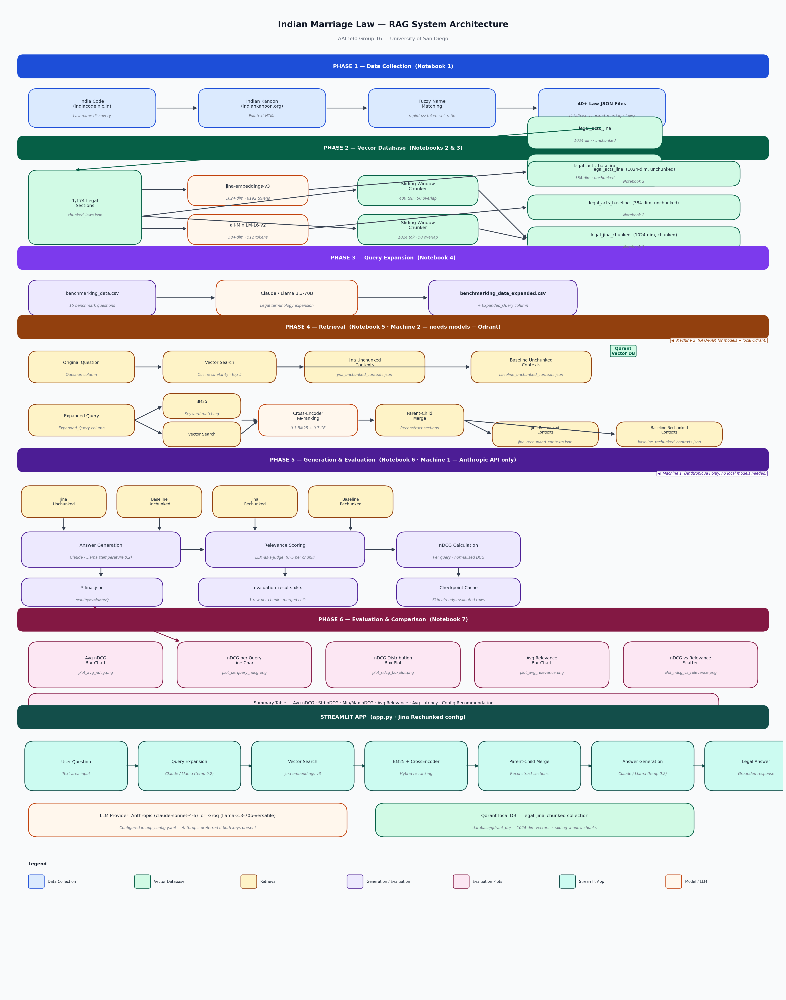

# Indian Marriage Law — RAG-Based Legal Assistant

A Retrieval-Augmented Generation (RAG) system that answers questions about Indian
marriage laws. It indexes 40+ Indian marriage statutes, retrieves relevant legal
sections using dense retrieval + BM25 + Cross-Encoder reranking, and generates
grounded plain-English answers.

**Built on [LangChain](https://python.langchain.com/) with [Anthropic Claude](https://www.anthropic.com/claude) as the only LLM provider.**

> Migrated and re-engineered from the AAI-590 (Group 16, University of San Diego)
> capstone. The retrieval + generation + evaluation pipeline now lives in an
> installable `src/` package built on LangChain; notebooks and the Streamlit app are
> thin orchestrators. The previous Groq / Llama fallback has been removed — Claude
> only.

---

## What It Does

A user asks a natural-language question such as *"Can a Hindu woman marry a Christian
man without converting?"* and the system:

1. **Expands** the question into formal legal terminology (Claude via LangChain).
2. **Retrieves** relevant sections from a Qdrant vector database (dense search →
   BM25 → Cross-Encoder re-ranking).
3. **Reconstructs** full legal sections from chunk fragments (parent-child merge).
4. **Generates** a plain-English answer grounded strictly in the retrieved law
   (Claude).

---

## Architecture



```text
User Question
      │
      ▼
Query Expansion ───────── Claude (claude-sonnet-4-6) via langchain-anthropic
      │
      ▼
Hybrid Retrieval  (LangChain HybridLegalRetriever)
  ├── Vector Search ───── jina-embeddings-v3 → Qdrant
  ├── BM25 Keyword Search
  └── Cross-Encoder Re-ranking ── ms-marco-MiniLM-L-6-v2
      │
      ▼
Parent-Child Merge  (rebuild full section from chunks)
      │
      ▼
Answer Generation ─────── Claude (grounded, temperature 0.2)
      │
      ▼
Answer
```

### Framework mapping (what LangChain provides)

| Concern | LangChain component |
|---|---|
| LLM (expansion / generation / judge) | `langchain_anthropic.ChatAnthropic` |
| Prompts + chains | `ChatPromptTemplate` + LCEL (`prompt \| llm \| parser`) |
| Embeddings | `langchain_huggingface.HuggingFaceEmbeddings` + custom `JinaV3Embeddings` |
| Retriever | custom `BaseRetriever` (`HybridLegalRetriever`) |
| Cross-encoder reranker | `langchain_community.cross_encoders.HuggingFaceCrossEncoder` |
| Vector store | `langchain_qdrant.QdrantVectorStore` (+ raw `qdrant-client` for hybrid search) |
| Documents | `langchain_core.documents.Document` |

### Four retrieval configurations evaluated

| Config | Embedding Model | Text Strategy | Query Input |
|---|---|---|---|
| Jina Unchunked | `jina-embeddings-v3` | Original sections | User question |
| Baseline Unchunked | `all-MiniLM-L6-v2` | Original sections | User question |
| Jina Rechunked | `jina-embeddings-v3` | Sliding-window chunks + hybrid retrieval | Expanded query |
| Baseline Rechunked | `all-MiniLM-L6-v2` | Sliding-window chunks + hybrid retrieval | Expanded query |

The Streamlit app uses **Jina Rechunked** (full hybrid, chunk-aware workflow).

---

## Project Structure

```text
├── pyproject.toml                 # uv/setuptools package (LangChain + Claude deps)
├── uv.lock                        # fully pinned, reproducible dependency lock
├── .python-version                # pins CPython 3.11 for uv
├── requirements.txt               # pip fallback mirror
├── config.yaml                    # API keys (git-ignored; env vars preferred)
├── .env.example                   # copy to .env
├── app.py                         # Streamlit UI — thin, imports from the package
├── generate_diagram.py            # regenerates architecture.png
│
├── src/indian_marriage_legal_recommender/    # ← all pipeline logic
│   ├── config.py                  # paths, model IDs, retrieval params, API keys
│   ├── llm.py                     # ChatAnthropic factory (Claude only)
│   ├── embeddings.py              # MiniLM + Jina v3 as LangChain Embeddings
│   ├── vectorstore.py             # Qdrant client / collections
│   ├── chunking.py                # sliding-window token chunker
│   ├── ingest.py                  # build the 4 Qdrant collections (notebooks 2-3)
│   ├── query_expansion.py         # Claude query-expansion chain (notebook 4)
│   ├── retrieval.py               # HybridLegalRetriever (notebook 5)
│   ├── generation.py              # grounded answer chain (notebook 6)
│   ├── evaluation.py              # LLM-as-judge relevance + nDCG (notebooks 6-7)
│   └── pipeline.py                # end-to-end expand → retrieve → generate
│
├── notebooks/                     # thin drivers that import from the package
│   ├── 1_data_gathering.ipynb
│   ├── 2_DB_creation.ipynb
│   ├── 3_Chunking.ipynb
│   ├── 4_Query_Expansion.ipynb
│   ├── 5_Retrieval.ipynb
│   ├── 6_Generation_and_Evaluation.ipynb
│   └── 7_Evaluation.ipynb
│
├── data/
│   ├── base_chunked_marriage_laws/   # one JSON per law
│   └── processed_data/               # benchmarks, links, flattened corpus
├── database/qdrant_db/               # local Qdrant (4 collections)
└── results/                          # contexts, evaluated outputs, plots, xlsx
```

---

## Setup

This project uses **[uv](https://docs.astral.sh/uv/)** for environment and dependency
management. The Python version (`3.11`, pinned in `.python-version`) and the full
locked dependency set (`uv.lock`) are committed, so installs are reproducible.

### Prerequisites
- [uv](https://docs.astral.sh/uv/getting-started/installation/) (`0.12+`)
- An **Anthropic API key**
- **No GPU required.** PyTorch installs as the CPU build; the embedding and
  cross-encoder models run fine on CPU (a GPU only speeds up bulk re-indexing).

### Install

```bash
uv sync
```

That's it — uv creates `.venv/`, fetches CPython 3.11 if needed, and installs the
exact locked dependencies (CPU PyTorch included). `system-certs = true` is set in
`pyproject.toml` so uv uses the OS trust store and works behind corporate
TLS-inspecting proxies.

> Not using uv? A `requirements.txt` mirror is provided as a fallback:
> `python -m venv .venv && pip install -e .`

### GPU / CUDA (optional — for future reference)

This app does **not** need a GPU, so the default install pulls the CPU build of
PyTorch from PyPI. If you later want CUDA acceleration (e.g. to re-embed the corpus
faster), pin the CUDA build via a dedicated PyTorch index.

Add this to `pyproject.toml` (CUDA 12.1 shown — match your driver):

```toml
# Dedicated CUDA wheel index (explicit = only used by the packages mapped below)
[[tool.uv.index]]
name = "pytorch-cu121"
url = "https://download.pytorch.org/whl/cu121"
explicit = true

# Route only the PyTorch packages to the CUDA index
[tool.uv.sources]
torch       = { index = "pytorch-cu121" }
torchvision = { index = "pytorch-cu121" }
torchaudio  = { index = "pytorch-cu121" }
```

Then re-lock and sync:

```bash
uv lock
uv sync
```

Notes:
- Other CUDA versions: swap `cu121` for `cu118`, `cu124`, etc. in both the index
  name and URL. See <https://pytorch.org/get-started/locally/> for the matrix.
- One-off (no pyproject change):
  `uv pip install torch==2.2.2 --index-url https://download.pytorch.org/whl/cu121`
- Verify the GPU is visible: `uv run python -c "import torch; print(torch.cuda.is_available())"`

### Configure the API key

Either set an environment variable / `.env` (preferred):
```bash
cp .env.example .env            # then edit ANTHROPIC_API_KEY
```
or fill in `config.yaml`:
```yaml
anthropic:
  api_key: "sk-ant-..."
```

---

## Running the App

```bash
uv run streamlit run app.py
```
Opens at `http://localhost:8501`. First load takes a minute while Jina v3 and the
Cross-Encoder load into memory. Requires the Qdrant collections to be populated
(they ship in `database/qdrant_db/`; rebuild with notebooks 2–3 if needed).

**Features:** plain-English Q&A · adjustable top-k · toggle retrieved sections ·
toggle expanded query.

### Using the pipeline directly

Run Python inside the project environment with `uv run python`:

```python
from indian_marriage_legal_recommender.pipeline import answer

result = answer("Can a Hindu woman marry a Christian man without converting?")
print(result.answer)
for section in result.sections:
    print("•", section)
```

---

## Running the Notebooks

Launch Jupyter through uv so it uses the project environment:
```bash
uv run jupyter lab        # or: uv run jupyter notebook
```

The pipeline is split across two machines: embedding models (Jina v3, Cross-Encoder)
want RAM/GPU, while generation + evaluation only need a Claude API key.

**Machine 2 (models + Qdrant):**
```
1_data_gathering.ipynb   → build the legal corpus
2_DB_creation.ipynb      → embed corpus into Qdrant (unchunked)
3_Chunking.ipynb         → add the chunked collections
4_Query_Expansion.ipynb  → expand the 15 benchmark queries (Claude)
5_Retrieval.ipynb        → retrieve contexts for all 4 configs
```
Copy `results/contexts/` to Machine 1, then:

**Machine 1 (Claude API only):**
```
6_Generation_and_Evaluation.ipynb   → answers + relevance + nDCG
7_Evaluation.ipynb                   → plots + summary table
```
Notebooks 4 and 6 checkpoint their work, so an interrupted run resumes.

---

## Evaluation

Benchmarked on 15 questions across three difficulty levels (Simple, Intermediate,
Tricky) covering Hindu, Muslim, Christian, Parsi, tribal, NRI, and interfaith
scenarios.

- **nDCG** — retrieval ranking quality (1.0 = perfect order).
- **Relevance (0–5)** — Claude-as-a-judge scoring of each retrieved chunk.
- **Latency** — end-to-end answer generation time.

Saved aggregate results (`results/evaluated/`):

| Configuration | Avg nDCG | Avg Relevance | Avg Latency (s) |
|---|---:|---:|---:|
| Baseline Unchunked | 0.8645 | 1.4244 | 10.50 |
| Baseline Rechunked | 0.9415 | 1.3844 | 17.89 |
| Jina Unchunked | 0.9589 | 1.8500 | 10.68 |
| Jina Rechunked | 0.8685 | 1.7011 | 18.69 |

---

## Qdrant Collections

| Collection | Model | Dim | Strategy |
|---|---|---:|---|
| `legal_acts_baseline` | all-MiniLM-L6-v2 | 384 | Full sections |
| `legal_acts_jina` | jina-embeddings-v3 | 1024 | Full sections |
| `legal_baseline_chunked` | all-MiniLM-L6-v2 | 384 | Sliding window, 400 tok, 50 overlap |
| `legal_jina_chunked` | jina-embeddings-v3 | 1024 | Sliding window, 1024 tok, 50 overlap |

---

## Key Design Decisions

- **Claude only.** All LLM calls (expansion, generation, LLM-as-judge) route through
  `langchain_anthropic.ChatAnthropic`. No Groq/Llama fallback.
- **LangChain as the RAG framework.** Retrieval is a first-class `BaseRetriever`;
  prompts are LCEL chains; embeddings and the cross-encoder are LangChain components.
- **Hybrid retrieval for chunked configs.** `final = 0.3·BM25 + 0.7·CrossEncoder`
  balances lexical precision (act names, section numbers) with semantic depth.
- **Parent-child merge.** Chunks are re-assembled into full sections before hitting
  the LLM so the answer sees coherent statutory context.
- **Grounded generation.** The prompt forces Claude to answer only from retrieved
  context and to say when the corpus does not cover the question.
